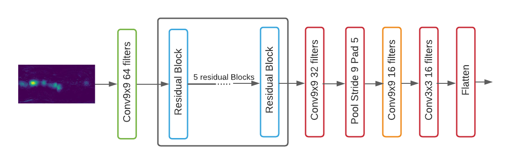
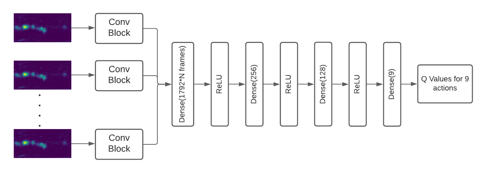
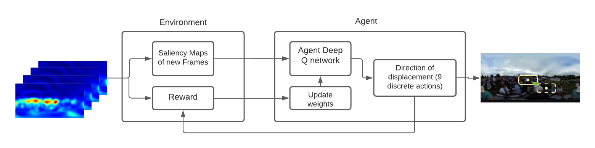

# Deep reinforcement learning approach to predict head movement in 360° videos
*Tanmay Ambadkar, Pramit Mazumdar*
-------

## Abstract

*The popularity of 360&deg; videos has grown immensely in the last few years. One probable reason is the availability of low-cost devices and ease in capturing them. Additionally, users have shown interest in this particular type of media due to its inherent feature of being immersive, which is completely absent in traditional 2D videos. Nowadays such powerful 360&deg; videos have many applications such as generating various content-specific videos (gaming, knowledge, travel, sports, educational, etc.), during surgeries by medical professionals, in autonomous vehicles, etc. A typical 360&deg; video when seen through a Head Mounted Display (HMD) gives an immersive feeling, where the viewer perceives standing within the real environment in a virtual platform. Similar to real life, at any point in time, the viewer can view only a particular region and not the entire 360&deg; content. Viewers adopts physical movement for exploring the total 360&deg; content. However, due to the large volume of 360&deg; media, it faces challenges during transmission. Adaptive compression techniques have been incorporated in this regard, which is in accordance with the viewing behaviour of a viewer. Therefore, with the growing popularity and usage of 360&deg; media, the adaptive compression methodologies are in development. One important factor in adaptive compression is the estimation of the natural field-of-view (FOV) of a viewer watching 360&deg; content using a HMD. The FOV estimation task becomes more challenging due to the spatial displacement of the viewer with respect to the dynamically changing video content. In this work, we propose a model to estimate the FOV of a user viewing a 360&deg; video using an HMD. This task is popularly known as the Virtual Cinematography. The proposed FOVSelectionNet is primarily based on a reinforcement learning framework. In addition to this, saliency estimation is proved to be a very powerful indicator for attention modelling. Therefore, in this proposed network we utilise a saliency indicator for driving the reward function of the reinforcement learning framework. Experiments are performed on the benchmark Pano2Vid 360&deg; dataset, and the results are observed to be similar to human exploration.*

Paper URL: [link](https://library.imaging.org/ei/articles/34/10/IPAS-367)

## Model Architecture

The model architecture can be broken down into 2 parts. The first part processes an individual 360 saliency frame to get an embedding for it. The downstream model takes all embeddings to output an action. 

### Frame Embedding Model

### Downstream Model

## Framework

A Deep RL framework consists of an environment and agent. We have created a custom environment for this task, which provides the starting frame, next frame on performning an action and a reward function. The agent is a Deep QN agent with 9 actions. It interacts with the environment to learn how to find the highest probable FOV. The following image describes the interactions of the environment and the agent. 

